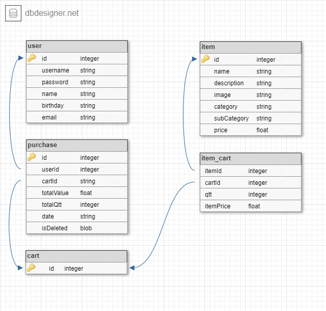

# salgadar_app
Aplicativo móvel de loja virtual de salgados e fast foods.

## Versões
1. Flutter: 1.22.5
2. Android SDK: 30.0.2
3. Node.js: 14.15.3

## Instruções para execução no emulador
Observações importantes para execução do aplicativo no emulador Android:
1. Instalar o [Node.js](https://nodejs.org/en/download/).
2. Abrir o terminal no diretório do arquivo servidor [salgadar.json](json_server/salgadar.json) e executar o seguinte comando de sistema:
  1. json-server --watch salgadar.json

## Features
O aplicativo possui as seguintes features:

1. Elementos de CRUD de usuário.
2. Elementos de CRUD de carrinho e compras.
3. Validações de campos de cadastro de usuário.
4. Cadastro prévio de itens (comidas e bebidas).
5. Cache de itens, compras e usuário no Banco de Dados SQLite.
6. Cache de preferências de usuário: tema, tamanho da fonte e login.
7. Filtro de itens por categoria (comida e bebida) e subcategoria (salgados, pizzas, sucos, ...).
8. Possibilidade de adição/remoção de quantidade de itens no carrinho.
9. Feedbacks de confirmação de finalização de compra e remoção de compra.
10. Verificação de conexão com internet nas operações de:
  10.1. Cadastro e alteração de usuário.
  10.2. Finalização de uma compra.
  10.3. Remoção de uma compra.
11. Animações com opacidade em cadastro/alteração de usuário, finalização de compra.
12. Notificação Local após a finalização da compra.
13. Configurações de Tema (Claro, escuro, alto contraste e definido pelo sistema) e tamanho da cor.
14. Carregamento de dados com Splash Screen.
15. Teste unitário do carrinho.
  
Observação: CRUD é um acrônimo para as quatro operações básicas para armazenamento persistente: cadastro (Create), leitura (Read), atualização (Update), e remoção (Delete).

## Screenshots
Splash Screen              |  Tela inicial
:-------------------------:|:-------------------------:
||

Tela de Login              |  Validações
:-------------------------:|:-------------------------:
||

Tela do carrinho           |  Tela de minhas compras
:-------------------------:|:-------------------------:
||

Notificação Local          |  Tela de configurações
:-------------------------:|:-------------------------:
||

Conexão com internet       |  Feedback de confirmação
:-------------------------:|:-------------------------:
||

Tema escuro                |  Alto Contraste
:-------------------------:|:-------------------------:
||

## Modelo relacional
O armazenamento das estruturas de dados utilizadas no aplicativo seguiu o seguinte Modelo Relacional:

## Imagens
As imagems dos itens foram retiradas do site [Unplash](https://unsplash.com/).

## Equipe desenvolvedora
- Elias Cícero Moreira Guedes (Mentorado).
- Israel Hudson Aragão Barbosa (Mentor).